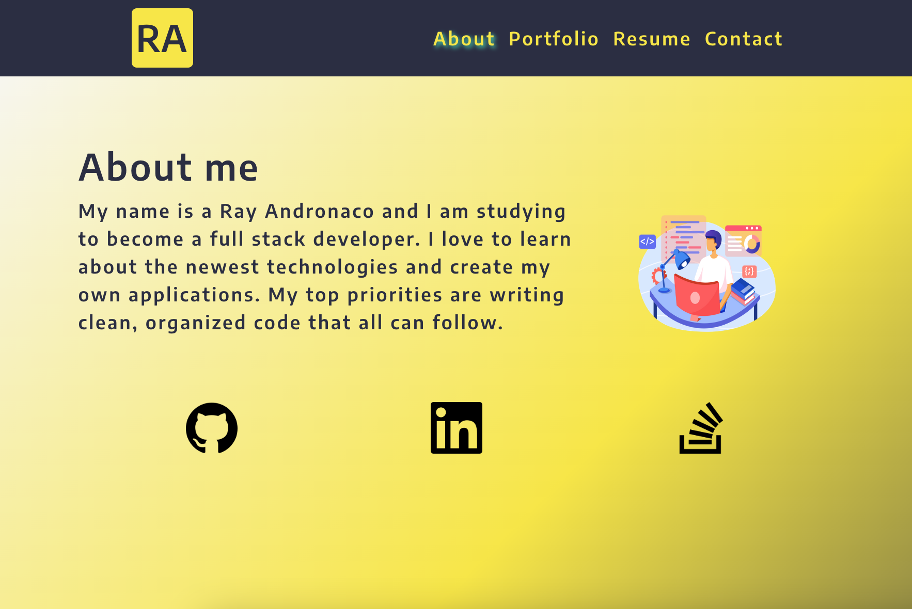
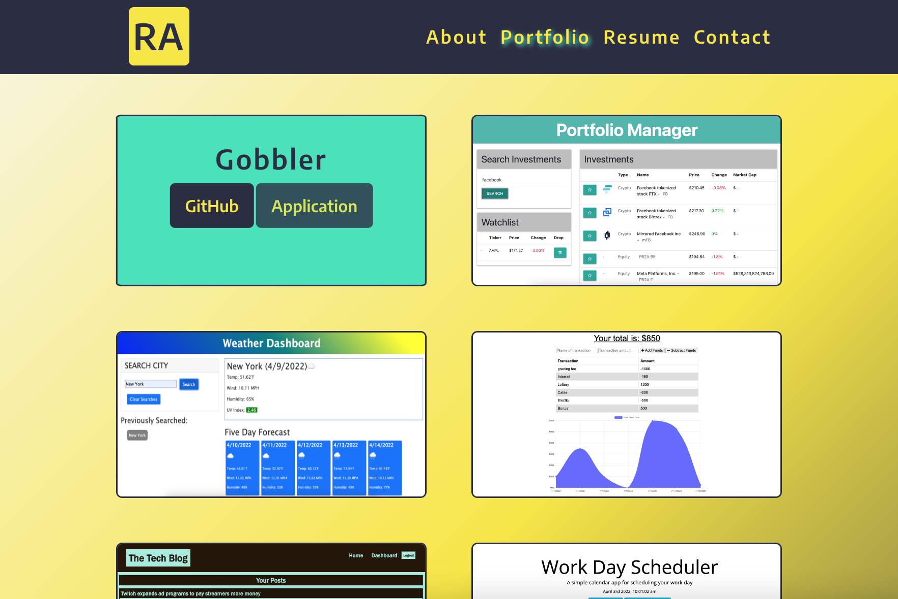

# React Portfolio

## User Story
AS AN employer looking for candidates with experience building single-page applications

I WANT to view a potential employee's deployed React portfolio of work samples

SO THAT I can assess whether they're a good candidate for an open position

## Functionality
This portfolio was built using react. When first loading the application the user is presented with an About section. The user can then use the links in the Navigation bar to click through the Portfolio, Resume and Contact form. The footer has links to my LinkedIn, GitHub and Stack Overflow accounts.

## Preview
### Landing Page

### Portfolio

## Links
GitHub Repo:

https://github.com/randronaco1027/budget-tracker

Heroku: 

https://radiant-sea-17338.herokuapp.com/ 
